# iron-stack-labs — Systems Engineering Revision Lab

> *"The engineer who ships, measures, and fixes beats the engineer who only reads. Build the thing. Write the BENEATH answer. Push it to GitHub."*

This repository consolidates the Layer 1 systems engineering projects of the Iron Stack curriculum. It is structured as a progressive multi-project workspace, containing step-by-step incremental branches demonstrating architectural evolution, system scaling, and security auditing.

---

## 1. Project Directory Index

Each folder represents an independent project within the systems stack, configured with its own virtual environment at `~/venvs/islab/<project>` and local logging directories.

| Project | System Architecture | Core Technologies | Location |
| :--- | :--- | :--- | :--- |
| **IS01P01** | **LiveChat Support API** | FastAPI + OpenAI Streaming + HTML SSE Client | [`is01p01-livechat-api/`](file:///home/sk/cowork/projects/iron-stack-labs/is01p01-livechat-api) |
| **IS01P02** | **Concurrency Tester** | FastAPI + Sync/Async HTTP Offloading + Matplotlib Benchmarks | [`is01p02-concurrency-tester/`](file:///home/sk/cowork/projects/iron-stack-labs/is01p02-concurrency-tester) |
| **IS01P03** | **Multitenant API** | FastAPI + LIFO Middleware Stack + Redis Rate Limiter + JWT | [`is01p03-multitenant-api/`](file:///home/sk/cowork/projects/iron-stack-labs/is01p03-multitenant-api) |
| **IS01P04** | **Local LLM Gateway** | FastAPI + Swappable OpenAI Client + Decentralized JWT Auth | [`is01p04-local-llm-gateway/`](file:///home/sk/cowork/projects/iron-stack-labs/is01p04-local-llm-gateway) |

---

## 2. Progressive Branch Strategy

To demonstrate incremental software development, each project step is committed on a progressive chain of Git branches. Hitting each Git tag compiles and runs that specific system iteration:

```mermaid
graph TD
    main --> l1-is01p01-step-1
    l1-is01p01-step-1 --> l1-is01p01-step-2
    l1-is01p01-step-2 --> l1-is01p01-step-3
    l1-is01p01-step-3 --> l1-is01p01-step-4
    l1-is01p01-step-4 --> l1-is01p01-step-5
    l1-is01p01-step-5 --> l1-is01p02-step-1
    l1-is01p02-step-1 --> l1-is01p02-step-2
    l1-is01p02-step-2 --> l1-is01p02-step-3
    l1-is01p02-step-3 --> l1-is01p02-step-4
    l1-is01p02-step-4 --> l1-is01p02-step-5
    l1-is01p02-step-5 --> l1-is01p03-step-1
    l1-is01p03-step-1 --> l1-is01p03-step-2
    l1-is01p03-step-2 --> l1-is01p03-step-3
    l1-is01p03-step-3 --> l1-is01p03-step-4
    l1-is01p03-step-4 --> l1-is01p03-step-5
    l1-is01p03-step-5 --> l1-is01p03-step-6
    l1-is01p03-step-6 --> l1-is01p04-step-1
    l1-is01p04-step-1 --> l1-is01p04-step-2
    l1-is01p04-step-2 --> l1-is01p04-step-3
    l1-is01p04-step-3 --> l1-is01p04-step-4
    l1-is01p04-step-4 --> l1-is01p04-step-5
```

### Git Tag Naming Rules:
* **IS01P01 Tags:** `v1.1.0-step1` to `v1.1.0-final`
* **IS01P02 Tags:** `v1.2.0-step1` to `v1.2.0-final`
* **IS01P03 Tags:** `v1.3.0-step1` to `v1.3.0-final`
* **IS01P04 Tags:** `v1.4.0-step1` to `v1.4.0-final`

---

## 3. Global Systems Constraints

All projects in this workspace strictly adhere to three core operational guidelines:

1. **Robust Exception Safety (Try-Except Everywhere):** Every function is wrapped in structured exception safety blocks, capturing trace contexts and formatting them into system-friendly errors or HTTP exceptions.
2. **Rotating Level-Based Logging:** Each project implements a customized, size-capped `RotatingFileHandler` writing telemetry to local `logs/app.log` (gitignored), paired with a standard terminal stdout StreamHandler.
3. **Isolated Environments:** Virtual environments are created outside of the workspace directory at `~/venvs/islab/<project-name>` to prevent repository pollution.

---

## 4. Academic Integrity & Private Logs

Theoretical notes, answers to system engineering questions (e.g. the BENEATH answers on kernel wait-states, Nginx buffering, PagedAttention block blocks, and ASGI signatures), and sequence maps are kept privately inside the companion repository: [IronStack_EdTEch/IRON_JOURNAL.md](file:///home/sk/cowork/projects/IronStack_EdTEch/IRON_JOURNAL.md).

---

## License

MIT © [Sachin Kolige](https://github.com/sachinks)
